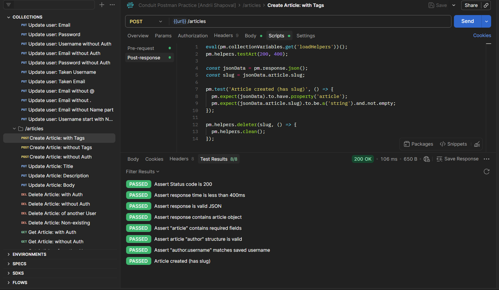

# Conduit API Testing

## Project Description

This project contains API testing of the Conduit article platform using Postman.

The goal of the project was to verify the functionality of the main API endpoints such as user authentication, articles management, and comments.

---

## Link to Postman Conduit API collection

)

---

## Scope

The following API features were tested:

• User registration  
• User login  
• Article creation  
• Article deletion  
• Comment creation  
• Comment deletion

---

## Testing Types

The following testing techniques were used:

• Positive testing  
• Negative testing  
• Validation testing  

---

## Tools

• Postman  
• JavaScript (Postman test scripts)  
• JSON (request body)

---

## Artifacts

• Postman Collection  
• API Test Scenarios  
• Bug Reports

---

## Example of executed tests

---

## Requirements

General

• You have 5 folders: "User", "Articles", "Profile", "Tags", and "Comments".    
• Your requests don't depend on your Environment.    
• All variables that you set with scripts are on the collection level.    		
• All of the other env. variables are set and used within each request.    		
• All of your requests are independent. (It means that each request works on its own, and doesn't need any previous request to be sent before).    
• You got first experience on how it can be done in the homework called: Postman Pre-requests Advanced."		
• Each of your requests passes    		
• All the tests in the "Tests" tab for each request "Passed". For "Failed" tests created bug reports.    		
• "You have used the Pre-request of the Collection or folder.    
• There you have all of your pre-request scripts: registration, creating an article, creating a comment, etc.    
• You are using your scripts from the Pre-request collection tab in your requests where they are needed.    
• All of the requests in the Collection are covered with tests.    
• These tests check not only the Status Code and Response time, but also the response body properties, if those exist, and the validation messages (if they are supposed to appear in the response).    
• Your current sets of tests are not called as so: basicTests1, basicTests2, basicTests3. Your namings are more specific, e.g. 'Assert response status code', 'Assert response time', 'Assert the response body properties'.    		
• "All of the created articles are being deleted calling a function from the tests section of your request.    
• The function is written in the Pre-request of your collection to not trash the DB with a constantly growing mass of test data.    	
• You have launched your collection 3 times without selected environment, all the requests passed successfully.    

Specific

• "Sign up with the taken email" (To make the request independent, you have signed up a user with an email in the Pre-request, and then you sign him up again with this same email in the request).    
• "Sign in with an empty password" (To make this request independent - you have registered a user in a pre-request, and are using his email in the sign-in request).    
•  "Sign up with taken username" (To make the request independent - you've signed up a user with a username in the Pre-request, and then you are signing him up again with this same username in the request).    
• "Sign up with taken username" (In the body of your request, you used the generated in the pre-request of registration 'username'. You did not hardcode some username).    
• "Sign up with taken username" (You have registered a user, took his username and you tried to register him once again. This is a case that caught an error because we don't want it to be possible to register with a taken username).    
• "Sign up with a username with 41 symbols" (This is a case that caught an error because we don't want it to be possible to register with a username of 41 symbols. You have created a dynamic variable here with the help of the info in the Postman Guide on how to write a function for creating a string of a particular length, and you are not using a hardcoded string).    
•  "Update an article" (To make the request independent, you have called two functions in the Pre-request of the request. One is for registering a user, and the next one is for creating an article, using a timeout (find more info about it in Postman Checklist) so that your pre-requests will be executed one after the other, not at the same time).    
•  "Delete an article" (Same thing here, using timeOut you have called two functions in the Pre-request of the request. One is to register a user, and the second one is to create an article).    
• "Get articles by tag" (Using timeOut you have called two functions in the Pre-requests of the request. One is to register a user, and the second one is to create an article. Use tag from the article creation on the Params tab of this request and don't add an Authorization header).    
• "Follow the user" Two requests for registration are called using timeout).    
• "Unfollow the user. (Two requests for registration are called using timeout, as well as the request to follow a user).    
• "Get tags. (No registration pre-request is used here).    
• "Get articles from Your feed" (You have called four functions in the pre-request of the request:    
    1. One, for registering a user;    
    2. The next one - to register the second user;    
    3. The next one - to create an article by the second user;    
    4. The next - for the first user to follow the second user.    
    (You have added timeouts where they are needed).    
    (In the request you are getting the first user’s “Your feed” articles))    
• "Comments" (In this requests folder, in each request in the Pre-request tab you have called the function to register a user, create an article, and create a comment. All of these make each of your requests independent).    	

