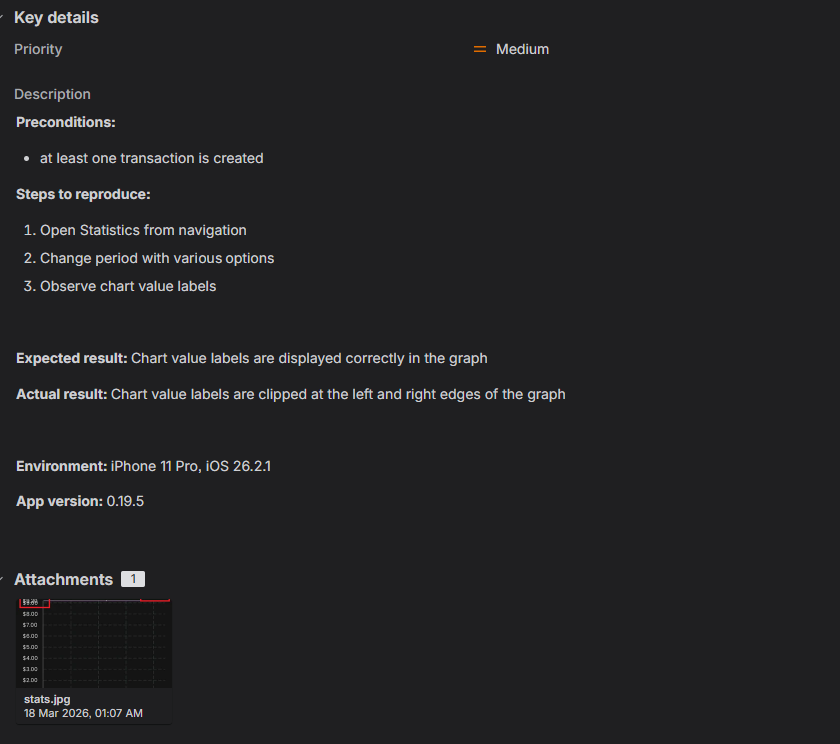
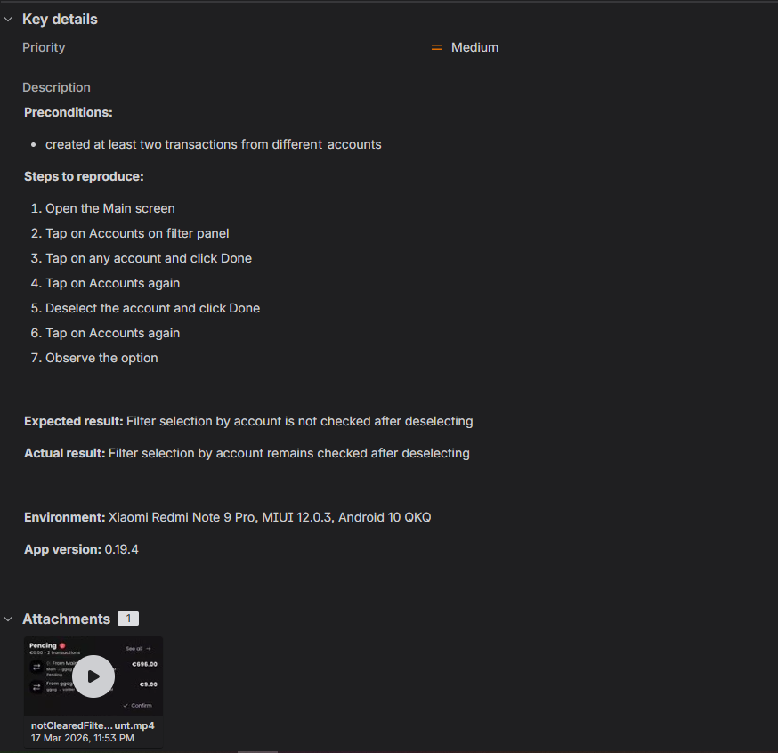
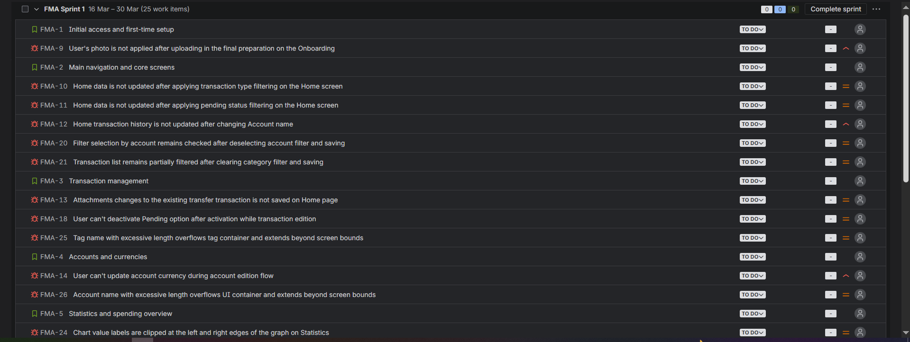

# Bug Reports

This section contains defect documentation prepared for the **Flow** mobile testing project.

The reported issues were identified during structured manual test execution and additional exploratory testing across selected Android and iOS environments.

The defect set includes functional, UI, localization, settings-related, and data consistency issues discovered during real application testing.

## Included Materials
- Sample bug report screenshot
- Jira backlog screenshot
- Examples of documented defects from the executed testing scope

## Screenshots

### Sample Bug Report 

### Sample Bug Report 

### Jira Backlog Overview

