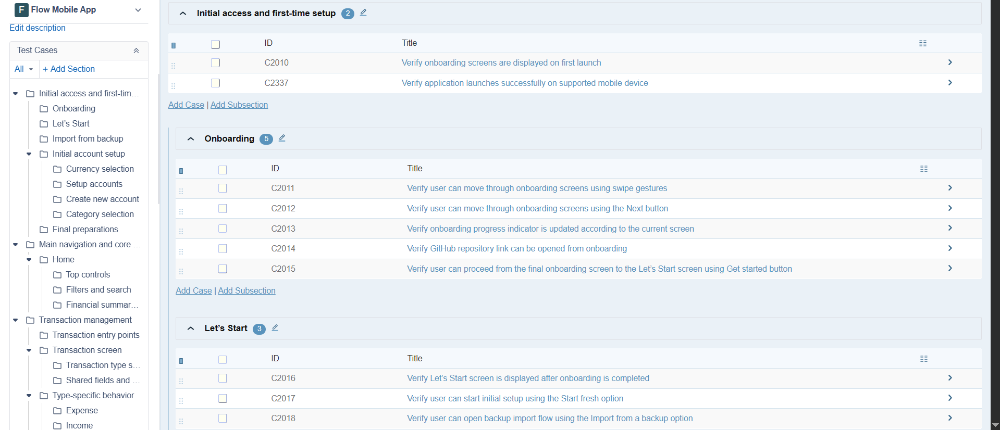
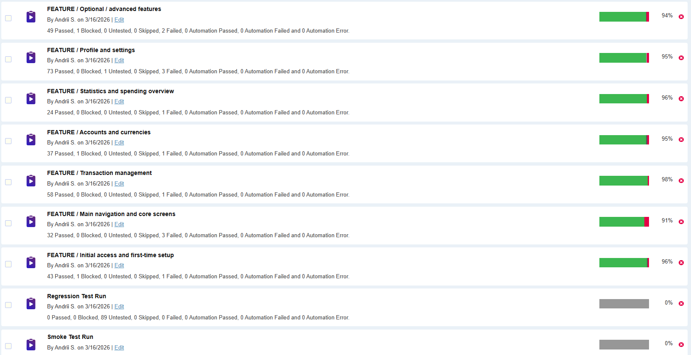

# Test Cases and Test Runs

This section contains visual evidence of the designed test coverage and executed test runs created for the **Flow** mobile testing project.

The test set was prepared in **TestRail** and organized by product features to support structured execution, traceability, and reporting.

## Included Materials
- Test case structure and feature-based coverage
- Executed test runs by feature
- Smoke test run
- Regression test run
- Full execution coverage

## Screenshots
### Test Cases Overview

### Test Runs Overview

