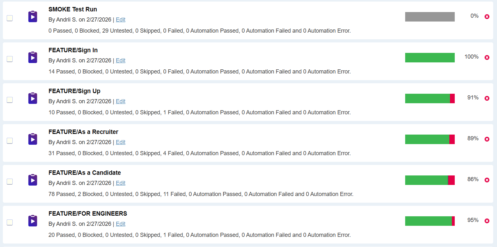
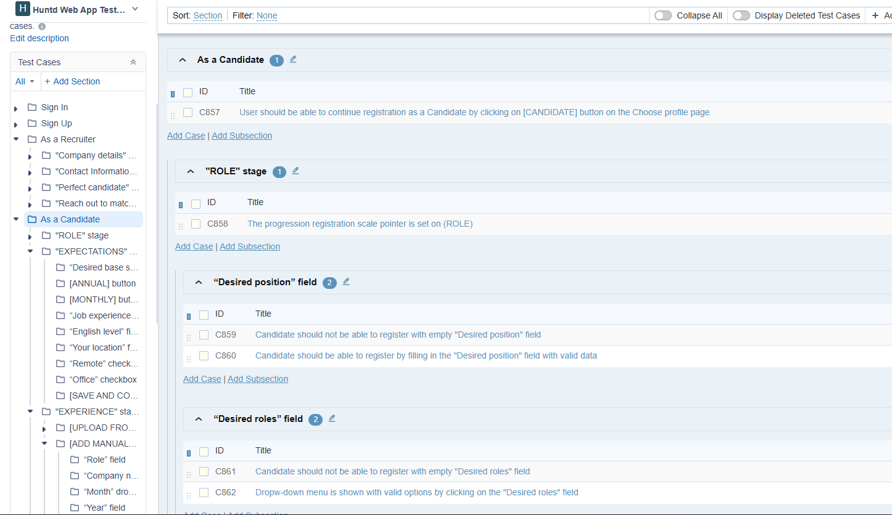
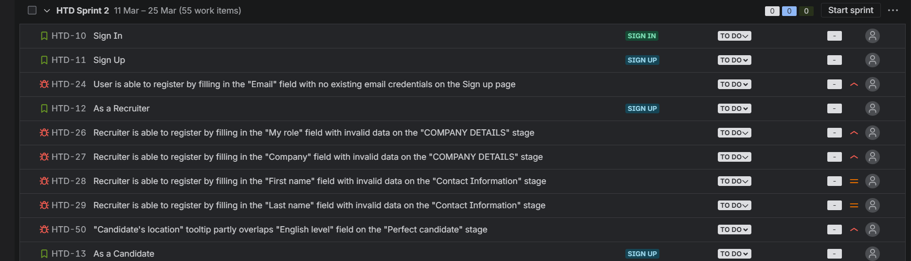

# Huntd – Web & Mobile Application Testing

## Project Overview

Huntd is a platform designed to connect engineers and recruiters through structured candidate discovery, communication, and hiring workflows.

The platform provides features such as:

- candidate discovery
- job posting and applications
- recruiter–candidate chat
- company directory
- structured candidate profiles

Testing was performed for both **Web** and **Mobile** versions of the application.

---

# Testing Scope

### Web application

Main features tested:

- Authentication (Sign in / Sign up)
- Candidate registration flow
- Recruiter registration flow
- Candidate search and filtering
- Candidate profiles
- Chat communication
- Profile management
- Job posting and job applications
- Web3 companies directory
- Footer navigation

### Mobile application (Android MVP)

Features tested:

- Sign in / Sign up
- Chat functionality
- Profile management
- Account settings

---

# Testing Approach

Manual testing was performed using structured QA documentation and test management tools.

Testing activities included:

- Test planning
- Requirements analysis
- Test case design
- Test execution
- Bug reporting
- Test reporting

---

# Tools Used

- TestRail – test case management and execution
- Jira – bug tracking
- Chrome DevTools
- Android Studio Emulator
- Physical Android Device

---

# Test Execution

### Web Application

| Metric | Value |
|------|------|
| Executed test cases | 347 |
| Passed | 324 |
| Failed | 21 |
| Pass rate | 93% |

### Mobile Application

| Metric | Value |
|------|------|
| Executed test cases | 114 |
| Passed | 93 |
| Failed | 8 |
| Pass rate | 82% |

---

# Test Management

### TestRail – Test Runs

Test cases were organized into the following runs:

- Smoke Test Run
- Feature Test Run
- Full Test Run

---

### TestRail – Test Cases

Test cases covered core business flows including authentication, candidate search, chat communication, and job management.

---

# Bug Tracking

### Jira Bug Board

Defects were reported and tracked in Jira.  
Each failed test case was linked to the corresponding bug.

---

# Key Findings

Several issues with potential business impact were identified:

### Missing validation

Many fields did not have proper validation, allowing invalid data.

Impact:
- spam accounts
- poor data quality

---

### Missing email confirmation

User accounts could be created without email verification.

Impact:
- potential creation of fake accounts
- reduced platform credibility

---

### Outdated company links

The homepage displayed top Web3 companies with outdated links.

Impact:
- reduced user trust
- incorrect information presented to users

---

# Conclusion

The platform demonstrates solid architecture and feature design.

However, several issues affecting **data validation, user trust, and information accuracy** were identified during testing.

Addressing these issues would significantly improve platform reliability and user confidence.
